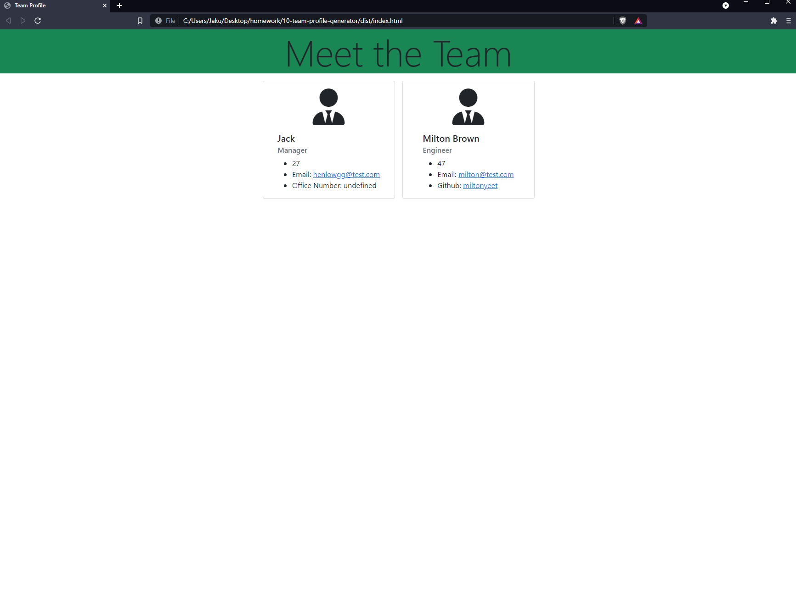
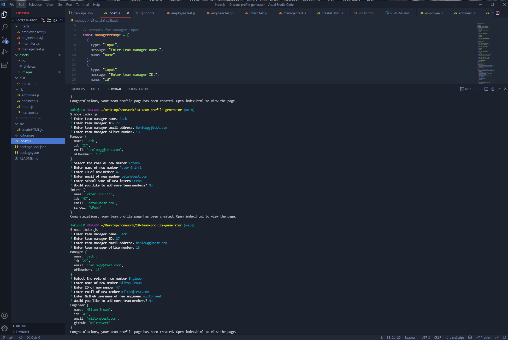

# jacks-team-profile-generator

Walkthrough Vid: 

Github Repo: 

## Description

This project was created to help team managers and developers create a profile for their team. This project allows the user to create a profile for their team and then share the profile with the team. This makes it so contact information are available to the team and the team can easily find each other. This also allows the user to maintain their team with ease.

## Installation

To use this project, you will need to install the following dependencies:
inquirer, jest, and npm.

Feel free to use this project as a starting point for your own project and if you have any questions or comments, feel free to reach out to me at [github.com/henlowgg]

## Usage

This app is designed to be used in the command line. To use this app, you will need to run the following command: "node index.js"
This app is intended to be used as a means of constructing a team profile for your team.

## Credits

Would like to thank my teachers and my classmates for helping me with this project. I would also like to thank my friends for helping me with this project and also huge shout out to Kyle Cook at Web Dev Simplified for his amazing video with tips on creating this project.

## License

This project is licensed under the MIT License.

## Contributing

Feel free to fork this project and make your own changes. 
